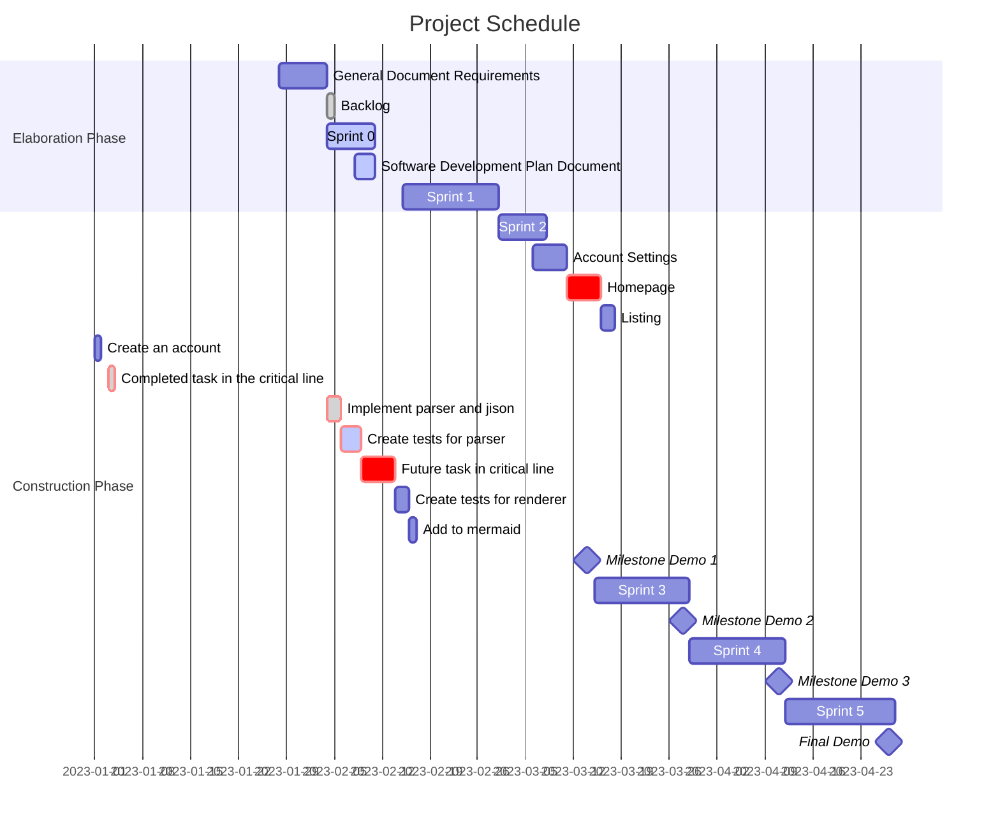

# Schedule

```mermaid
gantt
    dateFormat  YYYY-MM-DD
    title       Project Schedule

    section Elaboration Phase
    General Document Requirements: des1, 2023-01-28, 1w
    Backlog                   :    done, after des1, 1d
    Sprint 0                  :    active, des2, after des1, 1w
       Software Development Plan Document   : active, 2023-02-08, 3d
    Sprint 1                  :             , 2023-02-15, 2w
    

    section Construction Phase
    Sprint 2               :             , 2023-03-01, 1w
    Account Settings            :         des5, 2023-03-06, 5d
    Homepage                    :crit,  des6, after des5, 5d
    Listing                     :         des7, after des6, 2d
    Create an account           :         , 2023, 1d
    
    
    
    
    
    Completed task in the critical line :crit, done, 2023-1-03, 24h
    Implement parser and jison          :crit, done, after des1, 2d
    Create tests for parser             :crit, active, 3d
    Future task in critical line        :crit, 5d
    Create tests for renderer           :2d
    Add to mermaid                      :1d

   Milestone Demo 1                     :milestone, 2023-03-14, 0d
   Sprint 3                             :    , 2023-03-15, 2w
   Milestone Demo 2                     :milestone, 2023-03-28, 0d
   Sprint 4                             :    , 2023-03-29, 2w
   Milestone Demo 3                     :milestone, 2023-04-11, 0d
   Sprint 5                             :    , 2023-04-12, 16d
   Final Demo                           :milestone, 2023-04-27, 0d
   
```
