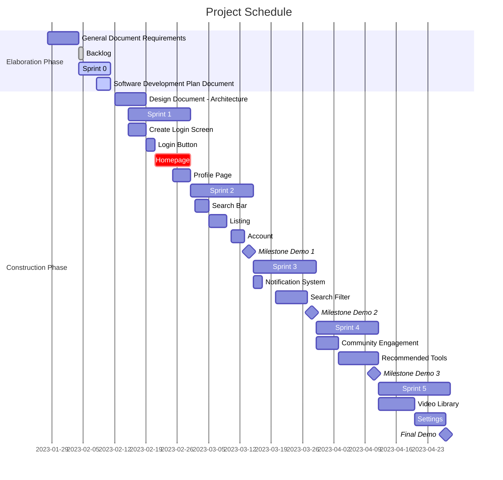

# Schedule

## Milestone Demos
Throughout the semester there will be 3 demonstrations of our project, below are the features and requirements that are applicable to said demonstrations.

Schedule | Project Tool Shed
Milestone Demo 1
F1. Accounts
    R1. User can create an account
    R2. User can login to their account
    R3. User can edit account 
F2. Homepage
    R1. User can view starting landing page
    R2. Logged in user should see previously looked at tools
    R3. Show listing of tools 
F3. Listing Tools
    R1. User can add a listing of their shared tool
    R2. User can view other listings of tools
    R3. User can remove or hide a tool listing (draft) 
    R4. User can edit an existing listing's title, description, image, availability, and price. 

Milestone Demo 2
F4. Notifications
    R1. User can receive notification when a tool they require is listed
    R2. Notification will show what the tool was and the new availability status 
F5. Search
    R1. User can enter text queries to find tools they are looking for
    R2. Search results show all of the tools within the search criteria
    R3. When the user updates the search bar the tools listed will change
F6. Recommended Tools
   R1. User will be recommended tools based on location and recently viewed tools
   R2. Tools recommended will change if a user changes their location or views different tools

Milestone Demo 3
F7. Aestically Pleasing UI
    R1. All web pages have a similar theme
    R2. Feedback from previous demos will be showcase in the sense of button, listing, and search beautification updates
F8. Video Library
    R1. User can enter the video library search 
    R2. User can search a "how to" or "help" video
    R3. User can be redirected to a Youtube video appropriate to their search

Final Demo
All features cleaned up and functional in occordance with the requirements listed above