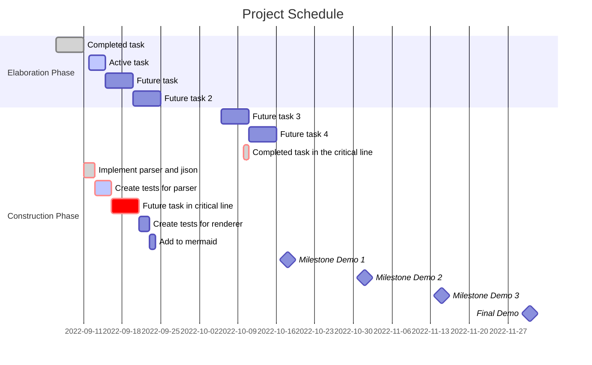

# Schedule

```mermaid
gantt
    dateFormat  YYYY-MM-DD
    title       Project Schedule

    section Elaboration Phase
    Completed task            :done,    des1, 2022-09-06,2022-09-11
    Active task               :active,  des2, 2022-09-12, 3d
    Future task               :         des3, after des2, 5d
    Future task 2             :         des4, after des3, 5d

    section Construction Phase
    Future task 3             :         des5, 2022-10-06, 5d
    Future task 4             :         des6, after des5, 5d
    Completed task in the critical line :crit, done, 2022-10-10,24h
    Implement parser and jison          :crit, done, after des1, 2d
    Create tests for parser             :crit, active, 3d
    Future task in critical line        :crit, 5d
    Create tests for renderer           :2d
    Add to mermaid                      :1d
   Milestone Demo 1                     :milestone, 2022-10-18, 0d
   Milestone Demo 2                     :milestone, 2022-11-01, 0d
   Milestone Demo 3                     :milestone, 2022-11-15, 0d
   Final Demo                           :milestone, 2022-12-01, 0d
   
```
