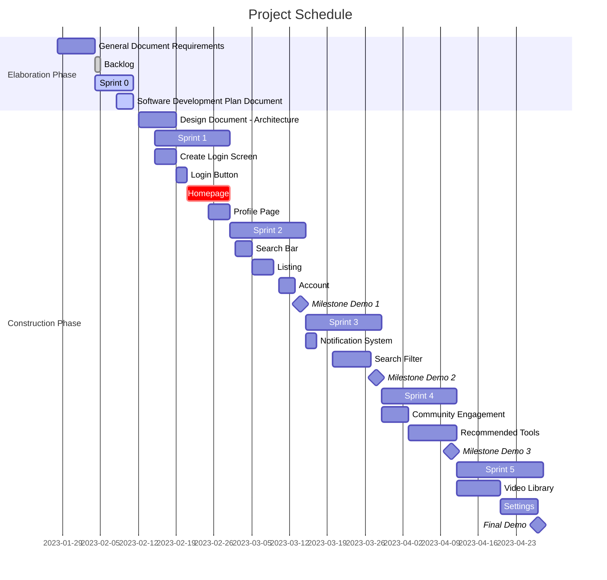

# Schedule

```mermaid
gantt
    dateFormat  YYYY-MM-DD
    title       Project Schedule

    section Elaboration Phase
    General Document Requirements: des1, 2023-01-28, 1w
    Backlog                   :    done, after des1, 1d
    Sprint 0                  :    active, des2, after des1, 1w
       Software Development Plan Document   : active, 2023-02-08, 3d
      

    section Construction Phase
    Design Document - Architecture :        , 2023-02-12, 1w
    
    Sprint 1                  :     , 2023-02-15, 2w
        Create Login Screen   : des5, 2023-02-15, 4d
        Login Button          : des6, after des5, 2d
        Homepage              : crit, 2023-02-21, 8d
        Profile Page          :     , 2023-02-25, 4d
    
    Sprint 2                  :     , 2023-03-01, 2w
        Search Bar            : des7, 2023-03-02, 3d
        Listing               : des8, after des7, 4d
        Account               :     , 2023-03-10, 3d
  
   Milestone Demo 1           :milestone, 2023-03-14, 0d
   
   Sprint 3                   :     , 2023-03-15, 2w
        Notification System   :     , 2023-03-15, 2d
        Search Filter         :     , 2023-03-20, 7d
   
   Milestone Demo 2           :milestone, 2023-03-28, 0d
   
   Sprint 4                   :    , 2023-03-29, 2w
        Community Engagement  :    , 2023-03-29, 5d
        Recommended Tools     :    , 2023-04-03, 9d
   
   Milestone Demo 3           :milestone, 2023-04-11, 0d
   
   Sprint 5                   :    , 2023-04-12, 16d
        Video Library         :    , 2023-04-12, 8d
        Settings              :    , 2023-04-20, 7d
   Final Demo                 :milestone, 2023-04-27, 0d
   
```
