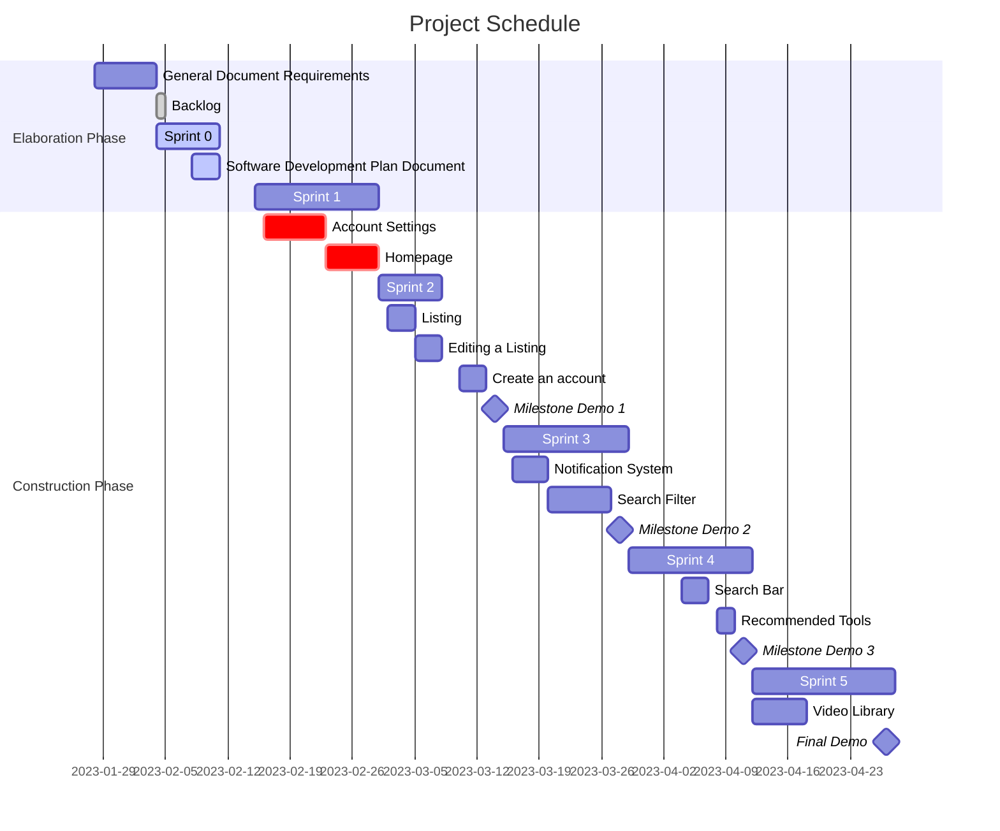

# Schedule

```mermaid
gantt
    dateFormat  YYYY-MM-DD
    title       Project Schedule

    section Elaboration Phase
    General Document Requirements: des1, 2023-01-28, 1w
    Backlog                   :    done, after des1, 1d
    Sprint 0                  :    active, des2, after des1, 1w
       Software Development Plan Document   : active, 2023-02-08, 3d
    Sprint 1                  :             , 2023-02-15, 2w
    

    section Construction Phase
    Account Settings            :crit,  des5, 2023-02-16, 7d
    Homepage                    :crit,  des6, after des5, 6d
    Sprint 2                    :             , 2023-03-01, 1w
        Listing                     :         des7, 2023-03-02, 3d
        Editing a Listing           :         des8, after des7, 3d
        Create an account           :         , 2023-03-10, 3d
  
   Milestone Demo 1                     :milestone, 2023-03-14, 0d
   Sprint 3                             :    , 2023-03-15, 2w
        Notification System          :   , 2023-03-16, 4d
        Search Filter                :   , 2023-03-20, 7d
   Milestone Demo 2                     :milestone, 2023-03-28, 0d
   Sprint 4                             :    , 2023-03-29, 2w
        Search Bar                  :         , 2023-04-04, 3d
        Recommended Tools            :        , 2023-04-08, 2d
   Milestone Demo 3                     :milestone, 2023-04-11, 0d
   Sprint 5                             :    , 2023-04-12, 16d
        Video Library                        :    , 2023-04-12, 6d
 
   Final Demo                           :milestone, 2023-04-27, 0d
   
```
