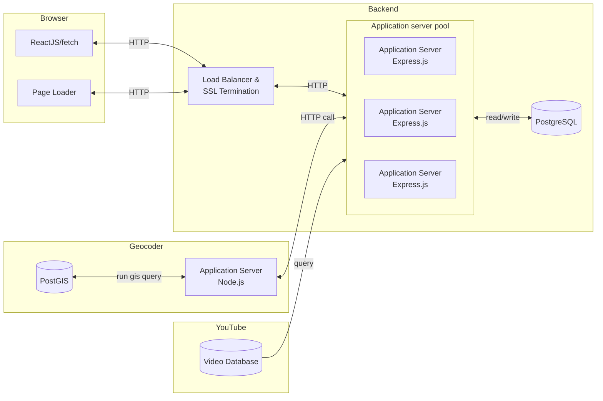

# System Block Diagram

<b>Figure 1.</b> High level technical design of the Tool Shed Website.
 
  
 

The application is a basic database-driven web application. Frontend clients (web browsers, mobile apps, etc) send HTTPS requests to a load balancer (which terminates SSL/TLS) and forwards the request to a pool of application servers. Each app server uses the database to fulfill requests, which get passed back through the load balancer to the client. This architecture allows for automatic scaling (out) to match the traffic the web application experiences to the number of servers serving the request.

In addition to using a databases, ToolShed also uses an in-house geocoding service based on the TIGER geocoder and PostGIS.

Figure 1 also shows that the HTTPS requests that come into the backend get SSL terminated. This is so that the application server can be designed with fewer dev-ops things in mind. Using the load balancer as a singular entry/exit point for the backend also frees up developers from having to worry about hardening their web application against attacks on the open internet.
