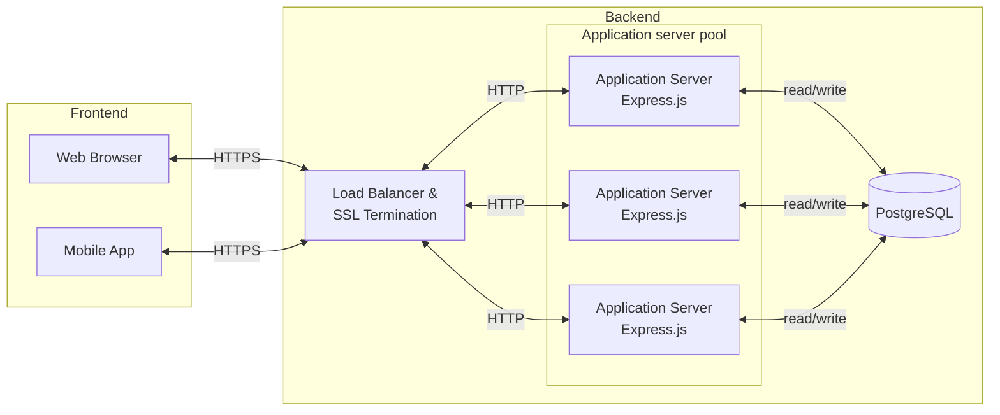

# System Block Diagram

```mermaid
graph LR
  subgraph backend [Backend]
  B[Load Balancer &\nSSL Termination] <-->|HTTP| C
  B <-->|HTTP| CC
  B <-->|HTTP| CCC
  subgraph Q [Application server pool]
  C[Application Server\nExpress.js]
  CC[Application Server\nExpress.js]
  CCC[Application Server\nExpress.js]
  end
  C <-->|read/write| D[(PostgreSQL)]
  CC <-->|read/write| D[(PostgreSQL)]
  CCC <-->|read/write| D[(PostgreSQL)]
  end
  subgraph frontend [Frontend]
  A[Web Browser] <-->|HTTPS| B
  E[Mobile App] <-->|HTTPS| B
  end
```
