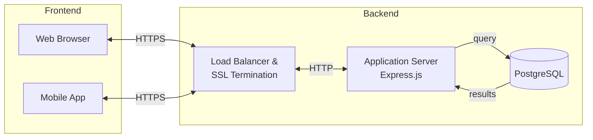

# System Block Diagram

```mermaid
graph LR
  subgraph backend [Backend]
  B[Load Balancer &\nSSL Termination] <-->|HTTP| C[Application Server\nExpress.js]
  C -->|query| D[(PostgreSQL)]
  D -->|results| C
  end
  subgraph frontend [Frontend]
  A[Web Browser] <-->|HTTPS| B
  E[Mobile App] <-->|HTTPS| B
  end
```
