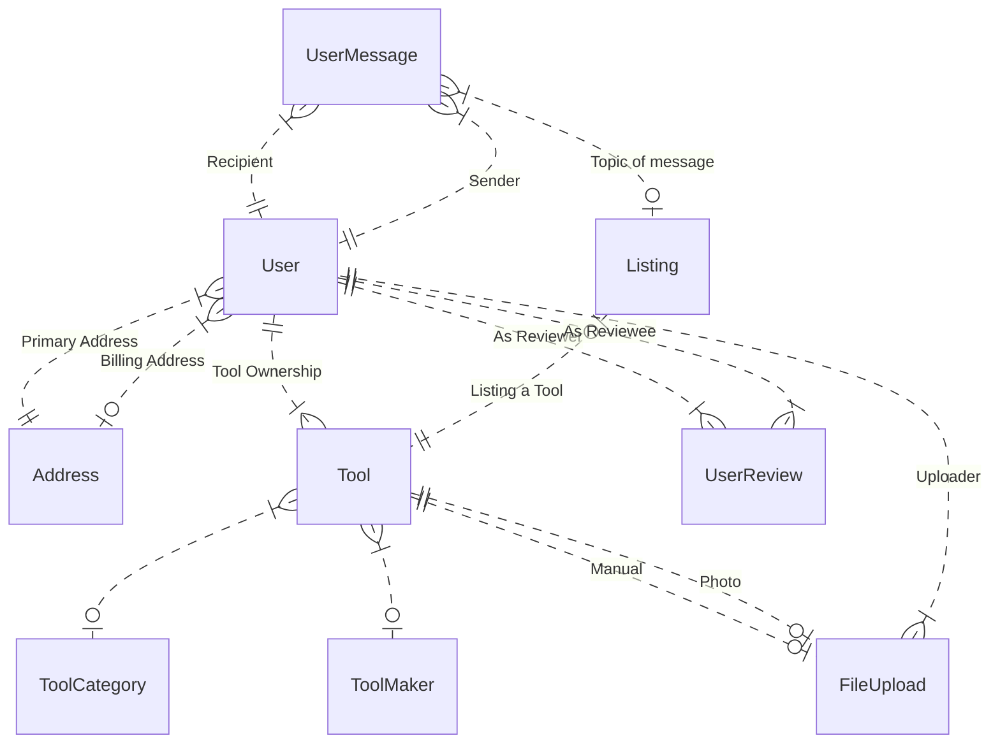

# Database 

## Database Diagrams

**Entity-relation diagram**

**Table Design**

The design of the tables is managed by Sequelize. Sequelize derives table and column names from model and attribute names (respectively). For more information, see `./models.js`.
