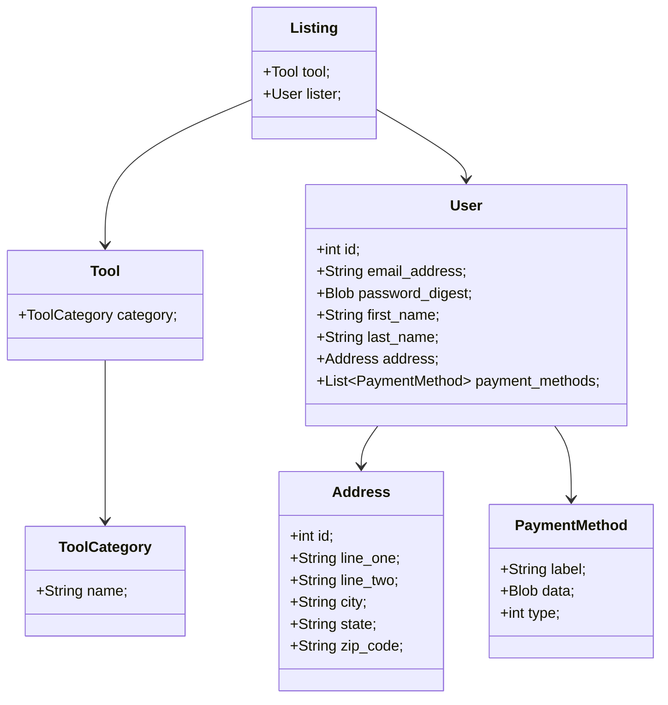

# Design

## Class Diagram

## Components & Interfaces

Toolshed is a thin-client webapp that loads/stores data from/in PostgreSQL.

The primary component of Toolshed is the backend webserver. The backend server implements the data model in the previous section via the Sequelize ORM, which manages migrations (table creation/updates based on data model changes) & query generation. Each endpoint on the backend server serves an HTML page based on data it loads from the database.

The database is PostgreSQL, which uses a TCP protocol (not too dissimilar to a binary version of HTTP) to transmit queries and result sets. As mentioned before, Sequelize will manage the schema of the database.

The client/frontend is currently a basic form-driven static HTML affair, with the expectation that as interactivity increases, the "thickness" of the client increases to the point where there is no more UI logic on the backend. This is made easier by the fact that the backend and frontend are both JavaScript.

## Sequence Diagram - Removing a Listing
[](https://mermaid.live/edit#pako:eNptksFOGzEQhl9l5BMVJA-wB6QUeqgUqMSGnixVE3vYteIdB8-YKkK8e-2waQPqzfI_3_if3_NqXPJkOiP0XIgd3QYcMk6W0WnKUAAFHoWy5T1mDS7skRViavfrNASG3mUi_qj7Jt-i4haFPqFHMogGHuCOuHyUpck9aZNl1quV8IJKUM9lcX19GVMHfdlOQaVaaSaqB0-sAaNAYtikFKEfycPjw9pyTI3yHdyM5HYCmkCIIDxBqaNBEKgt_F-7GNWyr8iiPfRAmgO91F5SnCORpxLjYW66KF2LYWjDBF4ul5Ypth4Nb_R90nNuxiq1yQfAAUNNjtifButgW1QT38TgduQvvlRgfkbG9HvVkqA5PWnqEZP_YHKGnfI8B9yIPFCvqEUu7n9sfq1-rr6vV1_X387gd3mu_RyAp38fY67MRHnC4OsuvVoGsEZHmsiarh495p01lt9qHRZN_YGd6TQXujJlX5M_7d3pknyo63f3vpvHFX37A8Pq8ZU)

## Sequence Diagram - Search for a Listing
[](https://mermaid.live/edit#pako:eNrVU8lOwzAQ_ZWRT6AuF245VEIqt0DpdkGRkGtPEgvHDl4kqqr_zmRpS6HlDDlZM29zPLNjwkpkCfP4HtEInCpeOF5l5l4E62Dt0WUG6GtOo8lkoG2hzLgMlU5gGTeVCh7aGggXJZqguPZgDays1bAsUcJ6kXYaJ-6IpEaNZAKpLRo2NcbjcytlJH70Vk0NhFbizcPNJoZgTQKLh6fV62o2S2874onQ6A86fal8rfkWHGVrMrX9X72ebR01Dwi5dRVwIztj8O11L1pNeeAb7pH-yTyFeUS3PVoceu2dv_o00AX62hqPR_S58FksXiDhc4e-vB6-zRxrSfnlj-xXXP5Q_PadPWoUNFe2Doom6e6fxO7HkwYaZnl-Sfsbq0dCZtiQVegqriTt4q7hZSyUWGHGEjpKzHnUIWOZ2ROUx2CXWyNYElzEIeueu19dluS0gVRFqWiFH7v9btd8yGpuXqw9YPafkGpRvQ)

## Sequence Diagram - Notify User when Tool is Available

Use Case Notify When Available

1. The user navigates to (URL:TBD) and enters their username and password followed by clicking the ‘Login’ button.  

2. The user clicks on the (button: RENT_TOOL) and completes the following fields. 

    -Name of Tool: Air Blower 

    -Zip Code: ##### 

    -Search Radius: 15 miles 

3. The user clicks (button: SEARCH_TOOL) which will complete the request and execute the database query. 

4. The user is presented with this result 

    -There are no Air Blowers within 15 miles 

    -Show rented out tools 

5. The user clicks (Show Rented Out Tools) which will show if that tool is being rented out in the area. 

6. The user is presented with the following results 

    -Gas Air Blower (NAME) (CONTACT) 

    -Electric (Battery) Air Blower (NAME) (CONTACT) 

    -Electric (Wireless) Air Blower (NAME) (CONTACT) 

7. The user clicks the desired item and receives a prompt. 

    -You will be notified when this item is listed. 
    

  

[](https://mermaid.live/edit#pako:eNq1VD1v2zAQ_SsXTjYaD101ZGiy1S0aKx4KGChO5EkiTJEqP2wIaf57T5Rs2HULdGg1CJR4fO_du-O9CukUiUIE-p7ISnrS2Hjsdhb4QRmdh20gP3336KOWukcbwQAGWLtGWyilJ7K3IWoMecKIFQa63a7G7Q_eHc_403vkg9XDwzswBZSp6nQMYDITEymyUaMJ4Cy8OGegbEnBdrM-S9YHjHSh2sAqoylGe17DcyI_wOKxJbkPHC-TRzmAq285lhNA5Qn3oOs53ccLEegJtJXOe5IRFp6i13RAAzpAsiFJSSHUycxIZzlZXjED1qgN5_ADXlgYNqhnL8mqaaFyBqvsB2ewodA7GwgWm4mPD5dnKjMsL_NezVTZVZ1L1nD8iePacqjmQGn06M6iSjE6WzCljd9Gu0-WZOwZWunQGxzCVI8xlA34gg39Cb13fTJcpAC18x2gVSfCkMt9yXFdt2s_qms__jKXsnVH2Fo8sO1YGcqyw_LfkgYy3BGzJe__b0KfXdT1AB39rjj5BHfn2CYBeu-6nhv1I1HPvgMNBC7FO_jqEhy1MVAR2BFPc5McW7IQW-4ao0PUtslt3Ssunbpjslk8_XLpxL3oyHeoFQ-W1zFoJ2JLHe1EwUuFfr8TO_vGcZiiKwcrRRF9onsxgc9DSBQ13zH-S0rzIPo0Tao8sN5-AiiKg38)

## Sequence Diagram - Selling a Tool

Use Case Selling a Tool

A homeowner wants to list a tool to sell it as they no longer need it anymore and for other users to be able to purchase it.

1. The user enters the URL.

2. The user enters their username and password.

3. The user clicks on the (button: LOGIN).

4. The user is brought to the homepage.

5. The user clicks on the (button: LIST_TOOL) and completes the following fields.

Name of tool

Zip Code: #####

Type of tool (Electric, Battery, Wireless, etc.)

Type of Listing (Sell or For Rent)

6. The user clicks on the (button: INSERT_IMAGE) to upload an image of the tool.

7. The user then clicks the (button: SUBMIT) to add tool to a listing.

8. The user sees a list of tools being sold after clicking submit.

9. The user can click the (button: LIST_TOOL) to list another tool if they want to.

10. The user clicks on the (button: LOG_OFF) to log off account.

11. The user exits the website.

  

[](https://mermaid.live/edit#pako:eNp1VMtu4zAM_BVCl90F2h_woZe2WSwQIEAeNwGFbNGpUFlyJapdo-i_L2W7rpJsbjJnSA6pkT9E4zWKSkR8TegafDDqGFQnHRmyCDu01rgjKNh7b6VTDfkACVSEQ8QgXa8Cmcb0yhHUOVwH_36BxIxw9O0c0BnQilStIo7lzZsihCRdgtu7O6greHSEAQ7bdYHX0tUjHr9w64_GgXGtD50i413BjtLFka0ruH_G5gVMC4n1AP41kWJB1Xy2BIYVzxNquJ0bHcqMOIXrOTy2j9wfYmoajLFN1g7Soc1zndXQHqP7QVOtstRjCLzejtPVEccRM5Aq2IcB1FEZngqdLpZzb03zwltPRN7Bz_Wf3f5pv9msfxUL2ua7ZdHAu4GFAf3Y47t5QEqBv88Z3yoeTOytGi4pixz2CzaU73r2TQQaegTfguVZOXRNV87Ih66UtJ0l5Tj8V8mUkZaMlbE2gk80I0uzHe9tKbS4YYpmA0IbfDfh5KFm07DTUZd3l5_A6AytUWfWPBK7QWPpoMudOny3A6SeO3Hq9Q3rr7muUc8vfr35_bRZrWYDlKVGp7FaduaRC_m2PZF5Kro--eLXJ25Eh_ySjOafw4d0AFLQM3YoRcVHja1KlqSQ7pOpKpHfDa4RFYWEN2JSP_9LRNUqfgWf_wDNxYKy)

## Sequence Diagram - Listing a Tool

Use Case Listing a Tool

The user would like to rent out tools that they are not currently using to earn some extra money.

1. The user navigates to (URL:TBD) and enters their username and password followed by clicking the (button: LOGIN).

2. The user clicks on the (button: LIST_TOOL) and completes the following fields.

    - Name of Tool

    - Zip Code: #####

    - Type of Tool (Electric, Battery, Wireless, etc.)

    - Type of Listing (For Rent)

    - Price (Price per hour/day/week)

3. The user clicks on the (button: INSERT_IMAGE) to upload images of the tool.

4. The user clicks the (button: SUBMIT) to add tool to the list of tools for rent.

5. The user is brought to the local listings menu once submission is successful.

6. The user clicks on the (button: LIST_TOOL) to repeat the process for as many tools as they would like to list for rent.

7. The user can then close the website or click the (button: LOG_OFF).

  

[](https://mermaid.live/edit#pako:eNqlVsFy2yAQ_RWGa52MHNmeSoccOrlkJr007aWjC4a1wwSBC8ipm8m_dwFZlhxnYiU-wYp97Nu3u-aZciOAltTBnwY0hxvJ1pbVlWbcG0ssaA-20gR_aJFb5mFgTOuL6-sv36x5cmBLEi2OSE1-_bg7cm0PJWu7Cc73YLfB14YwnHfkwdSwYWsg3pAlEGWYAHEElpySMa0R6oZ5tmQOSoJIVkIPSuCnI4j96WTe7y4Q5xCRb6w-iSLgDZw2GETpktK5Szcg08Po09mnBiFShkv0WmNK2wSRlbF1wBLSbRTbgSBGkwZdiOMWQL9CH2S-U62LbyWVipqla6QOFzAvjT5PwUO6OMgtZj3E4rpwUUUERtiPSYjBJHIJ5GNKbpmS4jXCGBVdwzk4t2pUJ0ekO1rMVrauLMbKxZXkj47cScztT2MUWTbej9eqbbYDzCGWsRINMT7Xa29ijdEqdNlpaqNlehfmPLVuNe48ua0DqfMFOxXPAKo2gqmxMcV26ro-pJhoCMXN7C62a2DMcIWcmRZ7Dq5Z1tKPqzMHWgxGAX8A_kjkijCl0tU4yUIs54z4PgmG7bjxOPy4lchPMnKWwsehpbkZmQWwE7X7ThOkWotMAj1jcS7gjJaghBvdBSmmjlpEdXKtT2h8ZhNoeIp6IlrUs5W33brPtUZvJqYUxnLpPr9_0aB6evb-M6PSVdsrdEJrwL8mKfDV8hxsFfUPUENFS1wKZh8rWukXPMcab-53mtNyxZSDCW02mMz9E6ezgpD41Pme3kHxOTShG6Z_G4NnvG0gbmn5TP_S8iq7uiy-5lmWL_KimE2LCd2hFY2L-ddZvphnsyIvpouXCf0XAbLLYjrNZ_Msm2f5fJZls5f_heo-HQ)

## Sequence Diagram - Use Case #6

    
As someone who uses this site to rent tools to make extra money, the user wants to be able to remove a tool listing to make sure it is available for their personal use.

    
1. The user navigates to (URL:TBD) and enters their username and password followed by clicking the ‘Login’ button.
2. The user clicks on the (button: ACTIVE_LISTINGS) and is presented with their active listings
    - AVAILABLE: Gas Hedge Trimmer (NAME) (CONTACT) (EDIT)
    - AVAILABLE: Circular Saw (NAME) (CONTACT) (EDIT)
    - AVAILABLE: 20-Gal Electric Air Compressor (NAME) (CONTACT) (EDIT)
3. The user clicks on the (button: EDIT) associated with the listing they would like to change
4. The user is presented with the following choices
    - Header: AVAILABLE: 20-Gal Electric Air Compressor (NAME) (CONTACT)
    - Change Availability (button: AVAILABLE) (button: NOT_AVAILABLE)
    - Change Contact Information (button: CHANGE_CONTACT_INFO)
    - Change Description (button: MODIFY_DESCRIPTION)
5. The user will select the (button: NOT_AVAILABLE) to remove the listing from the public eye. Now this tool cannot be rented, and it is only for personal use by the original lister
6. If the user wishes to list the same tool again, they click the Change Availability (button: AVAILABLE) to re-list the tool
    

## Algorithms
Tool Shed will constantly run and execute database queries to determine similar patterns and form submissions through known categories. Once jobs have been completed, Tool Shed will be able to recommend tools and supplies that are known to have successfully completed similar jobs in the past. Using Google YouTube API, search queries will be returned with instructional videos that are highly recommended in the how-to field. 

More TBD 

