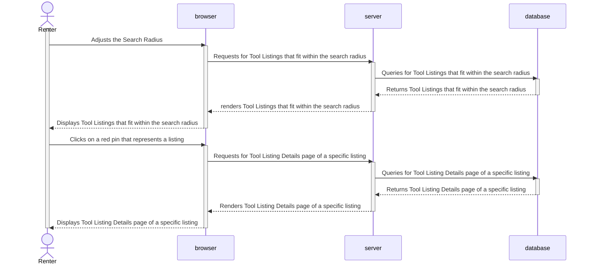

# Design

## Class Diagram

## Components & Interfaces

Toolshed is a thin-client webapp that loads/stores data from/in PostgreSQL.

The primary component of Toolshed is the backend webserver. The backend server implements the data model in the previous section via the Sequelize ORM, which manages migrations (table creation/updates based on data model changes) & query generation. Each endpoint on the backend server serves an HTML page based on data it loads from the database.

The database is PostgreSQL, which uses a TCP protocol (not too dissimilar to a binary version of HTTP) to transmit queries and result sets. As mentioned before, Sequelize will manage the schema of the database.

The client/frontend is currently a basic form-driven static HTML affair, with the expectation that as interactivity increases, the "thickness" of the client increases to the point where there is no more UI logic on the backend. This is made easier by the fact that the backend and frontend are both JavaScript.

## Sequence Diagram 1 - Search for Tool Listings

Use Case Search for Tool Listings

A user wants to search their local neighborhood for a hedge trimmer. They use Tool Shed to find a tool so that they can get the job done today and not go over their budget to purchase a brand-new one. 

1. The user navigates to http://toolshed.symer.io:5000/ and clicks on "Log In" to sign in to their account.

2. The user enters a tool (eg. hedge trimmer) into the Search Query

4. The user adjusts some of the filters (eg. Tool Category, Tool Maker, User Rating, Search Radius) to narrow down their search.

5. The user is presented with red pins on the map if there are any active tool listings that fit the search query.

6. The user can either click on the red pin to get the tool listing details or they can exit the website.

    

 

[](https://mermaid.live/edit#pako:eNrVU8lOwzAQ_ZWRT6AuF245VEIqt0DpdkGRkGtPEgvHDl4kqqr_zmRpS6HlDDlZM29zPLNjwkpkCfP4HtEInCpeOF5l5l4E62Dt0WUG6GtOo8lkoG2hzLgMlU5gGTeVCh7aGggXJZqguPZgDays1bAsUcJ6kXYaJ-6IpEaNZAKpLRo2NcbjcytlJH70Vk0NhFbizcPNJoZgTQKLh6fV62o2S2874onQ6A86fal8rfkWHGVrMrX9X72ebR01Dwi5dRVwIztj8O11L1pNeeAb7pH-yTyFeUS3PVoceu2dv_o00AX62hqPR_S58FksXiDhc4e-vB6-zRxrSfnlj-xXXP5Q_PadPWoUNFe2Doom6e6fxO7HkwYaZnl-Sfsbq0dCZtiQVegqriTt4q7hZSyUWGHGEjpKzHnUIWOZ2ROUx2CXWyNYElzEIeueu19dluS0gVRFqWiFH7v9btd8yGpuXqw9YPafkGpRvQ)

## Sequence Diagram 2 - Find Nearby Tool Listings

Use Case Find Nearby Tool Listings

A user has an unexpected afternoon off from work and wants to see what tools are available now to see what projects they can complete around the house. 

1. The homeowner visits the website, logs in to their account, and ends up on the homepage of the website.

2. The homeowner scrolls down to the map.

4. The homeowner is able to adjust the Search Radius.

5. The homeowner is presented with red pins on the map if there are any nearby listings.

6. The homeowner can click on any of the red pins to view the tool listing details or exit the website.

 

## Sequence Diagram 3 - Edit Tool Details

Use Case Edit Tool Details

A user wants to edit the details of a tool that they have already added to their account. 

1. The user navigates to the website, logs in to their account, and ends up on the homepage of the website. 

2. The user clicks on the "General" dropdown menu and clicks on "Tools". 

3. The user sees all the tools they've added to the site.

4. The user clicks on the "Edit Tool" button of the tool they want to edit.

5. The user sees all the current information on the tool. 

6. The user clicks on the textbox under description.

7. The user deletes the current text under description and enters new information. 

8. The user then clicks the "Save" button.

9. The user clicks on the "General" dropdown menu and clicks on "Tools" where the user will see that the tool description has changed.

10. The user exits the website.

  

## Sequence Diagram 4 - List a Tool

Use Case List a Tool

A user would like to rent out tools that they are not currently using to earn some extra money. 

1. The user navigates to the website, logs in to their account, and ends up on the homepage of the website. 

2. The user clicks on the "General" dropdown menu and clicks on "Add Tool". 

3. The user fills out the form

    - Name of Tool 

    - Description 

    - Category

    - Maker

3. The user adds a YouTube video on how to use tool, photo and/or manual.

4. The user clicks the button "Create".

5. The user scrolls down to Listings and clicks "+ New Listings".

6. The user clicks "Active" and fills out price, max # of billing intervals and billing interval.

7. The user clicks "Create" to create a new listing.

5. The user can scroll down to Listings and click "+ New Listings" to create more listings of the same tool or exits the website.

  

[](https://mermaid.live/edit#pako:eNqlVsFy2yAQ_RWGa52MHNmeSoccOrlkJr007aWjC4a1wwSBC8ipm8m_dwFZlhxnYiU-wYp97Nu3u-aZciOAltTBnwY0hxvJ1pbVlWbcG0ssaA-20gR_aJFb5mFgTOuL6-sv36x5cmBLEi2OSE1-_bg7cm0PJWu7Cc73YLfB14YwnHfkwdSwYWsg3pAlEGWYAHEElpySMa0R6oZ5tmQOSoJIVkIPSuCnI4j96WTe7y4Q5xCRb6w-iSLgDZw2GETpktK5Szcg08Po09mnBiFShkv0WmNK2wSRlbF1wBLSbRTbgSBGkwZdiOMWQL9CH2S-U62LbyWVipqla6QOFzAvjT5PwUO6OMgtZj3E4rpwUUUERtiPSYjBJHIJ5GNKbpmS4jXCGBVdwzk4t2pUJ0ekO1rMVrauLMbKxZXkj47cScztT2MUWTbej9eqbbYDzCGWsRINMT7Xa29ijdEqdNlpaqNlehfmPLVuNe48ua0DqfMFOxXPAKo2gqmxMcV26ro-pJhoCMXN7C62a2DMcIWcmRZ7Dq5Z1tKPqzMHWgxGAX8A_kjkijCl0tU4yUIs54z4PgmG7bjxOPy4lchPMnKWwsehpbkZmQWwE7X7ThOkWotMAj1jcS7gjJaghBvdBSmmjlpEdXKtT2h8ZhNoeIp6IlrUs5W33brPtUZvJqYUxnLpPr9_0aB6evb-M6PSVdsrdEJrwL8mKfDV8hxsFfUPUENFS1wKZh8rWukXPMcab-53mtNyxZSDCW02mMz9E6ezgpD41Pme3kHxOTShG6Z_G4NnvG0gbmn5TP_S8iq7uiy-5lmWL_KimE2LCd2hFY2L-ddZvphnsyIvpouXCf0XAbLLYjrNZ_Msm2f5fJZls5f_heo-HQ)

## Sequence Diagram 5 - Remove a Tool Listing

    
Use Case Remove a Tool Listing

    
As someone who uses this site to rent tools to make extra money, the user wants to be able to remove a tool listing to make sure it is available for their personal use. 

1. The user navigates to the website, logs in to their account, and ends up on the homepage of the website.  

2. The user clicks on the "General" dropdown menu and clicks on "Listings" to view their current listings. 

3. The user selects a listing that they want to remove and clicks on "Edit".

4. The user scrolls down to "Listings" and sees the "Active" button which is blue to show it's active.

5. The user clicks on the "Active" button and it turns grey, which shows it's inactive now.

6. The user clicks on "Save".

7. The user exits the website.
    

## Sequence Diagram 6 - Review Tool Owner

Use Case Review Tool Owner

A user wants to review their experience with the rented tool and the tool owner.

1. The user navigates to the website, logs in to their account, and ends up on the homepage of the website. 

2. The user clicks on the "General" dropdown menu and clicks on "Create Review". 

3. The user sees a list of users.

4. The user finds the user they want to review and clicks the button "Review User".

5. The user writes a review in the text box and selects a star rating. 

6. The user clicks submit. 

7. The user exits the website.
    

  

## Algorithms
Tool Shed will constantly run and execute database queries to determine similar patterns and form submissions through known categories. Once jobs have been completed, Tool Shed will be able to recommend tools and supplies that are known to have successfully completed similar jobs in the past. Using Google YouTube API, search queries will be returned with instructional videos that are highly recommended in the how-to field. 

